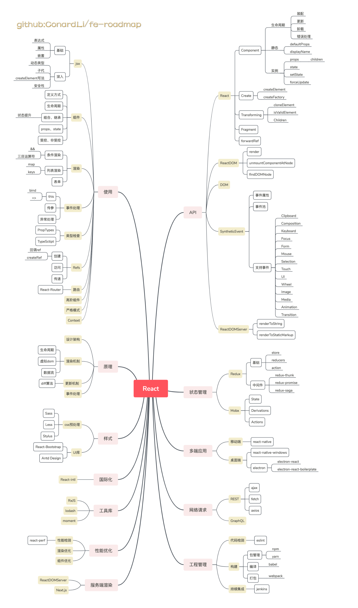

> 图不清楚请右键保存到本地查看

## 【使用】

**快速上手React，并了解其中的概念。**

- [官方教程](https://react.docschina.org/tutorial/tutorial.html)

- [React入门教程](http://www.ruanyifeng.com/blog/2015/03/react.html)

- [React.js 小书](http://huziketang.mangojuice.top/books/react/)

**React文章精读，问题解答。**

- [React中文社区](http://react-china.org/)

- [Segmentfault](https://segmentfault.com/t/react.js)

- [掘金](https://juejin.im/tag/React.js)

## 【API】

**全面浏览API**

- [官方文档](https://react.docschina.org/)

- [React](https://react.docschina.org/docs/react-api.html)

- [Component](https://react.docschina.org/docs/react-component.html)

- [ReactDOM](https://react.docschina.org/docs/react-dom.html)

- [DOM](https://react.docschina.org/docs/dom-elements.html)

- [合成事件](https://react.docschina.org/docs/events.html)

- [ReactDOMServer](https://react.docschina.org/docs/react-dom-server.html)

## 【状态管理】

**大型项目必备**

### Redux

- [Redux快速入门](http://www.ruanyifeng.com/blog/2016/09/redux_tutorial_part_one_basic_usages.html)

- [Redux中文文档](https://cn.redux.js.org/)

- [Redux源码](https://github.com/reduxjs/redux)

### Mobx

- [Mobx快速入门](https://www.zcfy.cc/article/mobx-ten-minute-introduction-to-mobx-and-react-4306.html?t=new)

- [Mobx中文文档](https://cn.mobx.js.org/)

- [Mobx源码](https://github.com/mobxjs/mobx)

## 【原理分析】

**深入理解**

- [React源码](https://github.com/facebook/react)

- [React源码解析](https://juejin.im/post/5a84682ef265da4e83266cc4)

- [React底层揭秘](https://github.com/Bogdan-Lyashenko/Under-the-hood-ReactJS)

- [React Diff算法](https://zhuanlan.zhihu.com/p/20346379)

## 【多端应用】

### 移动端

- [React Native](https://reactnative.cn/)

### 桌面端

- [react-native-windows](https://github.com/Microsoft/react-native-windows)

- [electron](https://github.com/electron/electron)

- [electron-react-boilerplate](https://github.com/electron-react-boilerplate/electron-react-boilerplate)

- [electron-react](https://github.com/ConardLi/electron-react)
 
## 【样式】

### CSS预处理

- [Sass](https://sass-lang.com/)

- [Less](https://github.com/less/less.js)

- [stylus](http://stylus-lang.com/)

### UI库

- [ant-design](https://github.com/ant-design/ant-design)

- [react-bootstrap](https://github.com/react-bootstrap/react-bootstrap)

## 【国际化】

- [React Intl](https://github.com/yahoo/react-intl)

## 【工具库】

- [Rxjs](https://cn.rx.js.org/)

- [moment](http://momentjs.cn/)

- [Lodash](https://www.lodashjs.com/)

## 【网络请求】

### Rest

- [fetch](https://developer.mozilla.org/en-US/docs/Web/API/Fetch_API)

- [axios](https://github.com/axios/axios)

### GraphQL

- [GraphQL](http://graphql.cn/learn/)

## 【性能优化】

- [react-addons-perf](https://www.npmjs.com/package/react-addons-perf)

- [性能优化](https://react.docschina.org/docs/optimizing-performance.html)

- [高性能 React 组件](https://imweb.io/topic/577512fe732b4107576230b9)

## 【工程管理】

### 代码检测

- [eslint](https://cn.eslint.org/)

### 构建

- [npm](https://www.npmjs.com/)
- [yarn](https://yarn.bootcss.com/)
- [babel](https://www.babeljs.cn/)
- [webpack](https://www.webpackjs.com/)

### 持续集成

- [jenkins](https://github.com/jenkinsci/jenkins)

## 【服务端渲染】

[ReactDOMServer](https://react.css88.com/docs/react-dom-server.html)

[Next.js](https://github.com/zeit/next.js/)
